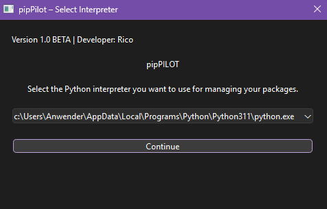
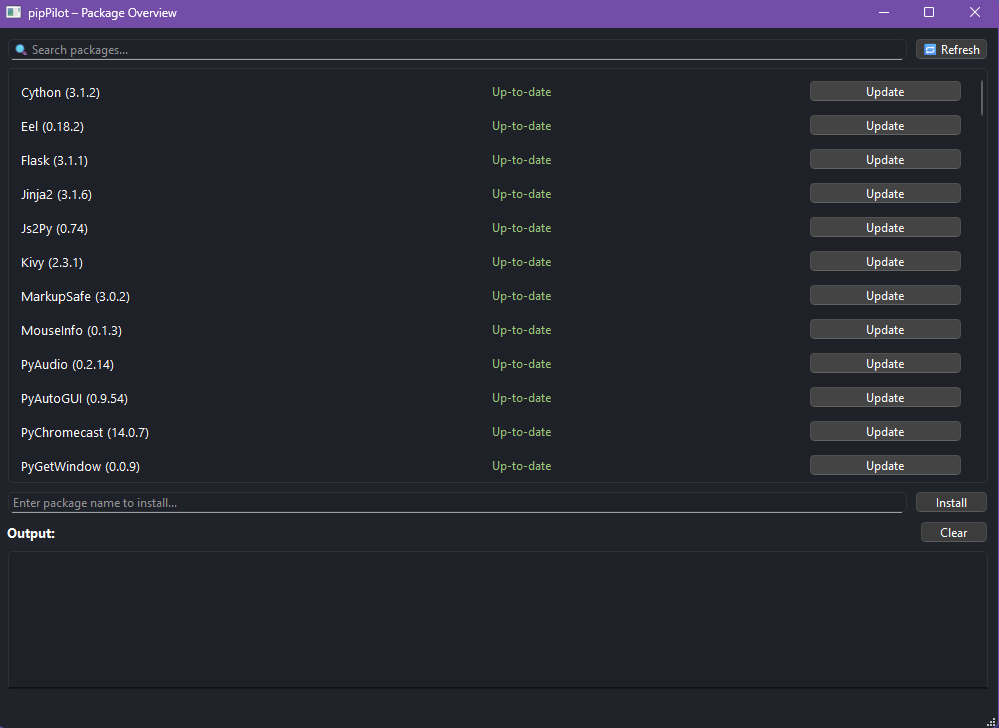

# pipPilot

**pipPilot** is a sleek and user-friendly graphical interface for managing Python packages across multiple Python interpreters on your system.

This tool was originally created for my personal use, but I decided to share it with the community for those who are tired of manually managing packages one by one and just want a simple, clear overview of everything in one place.

## Features

- Display installed Python packages with current and latest versions
- Highlight outdated packages and allow easy updates
- Install new packages by entering the package name
- Select the Python interpreter you want to manage
- Clean and modern dark-themed interface
- Real-time update logs and progress feedback

---
## Preview

## Status

This tool is currently in active development and will be available soon on GitHub. Stay tuned!

## Usage

At launch, select your preferred Python interpreter, then manage your packages effortlessly via the intuitive GUI.

## Developer

Created by Brejax (Rico) - www.devluxe.eu

---
