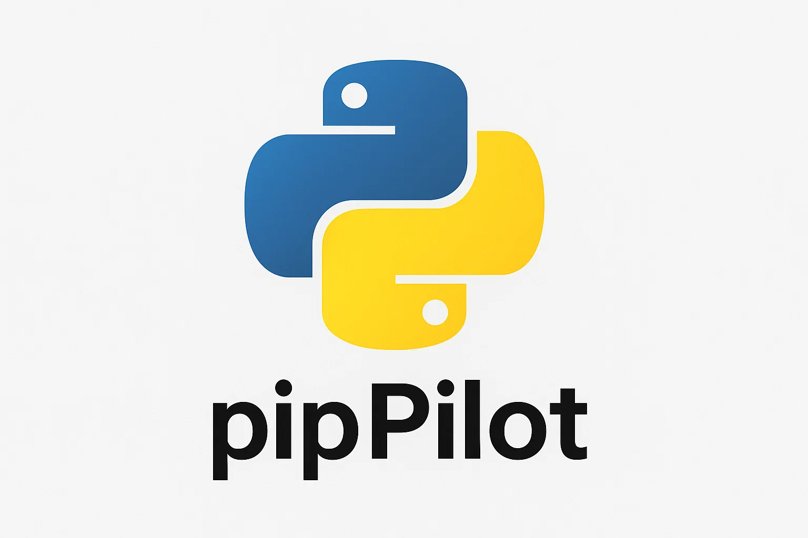

# pipPilot

**pipPilot** is a sleek and user-friendly graphical interface for managing Python packages across multiple Python interpreters on your system.

This tool was originally created for my personal use, but I decided to share it with the community for those who are tired of manually managing packages one by one and just want a simple, clear overview of everything in one place.

## Features

- Display installed Python packages with current and latest versions  
- Highlight outdated packages and allow easy updates  
- Install new packages by entering the package name  
- Uninstall packages with confirmation dialog  
- Select the Python interpreter you want to manage  
- Clean and modern dark-themed interface  
- Real-time update/uninstall logs and progress feedback  

---

## Preview

  


---

## Installation & Usage

1. **Clone the repository**  
   ```bash
   git clone https://github.com/mambuzrrr/pipPilot.git
   cd pipPilot
   ```

2. **Install dependencies**
   ```bash
   pip install -r requirements.txt
   ```

3. **Run the application**
   ```bash
   python run.py
   ```
- A dialog will prompt you to select one of the detected Python interpreters.
- After selection, the main window opens showing all installed packages.
- Use the Search bar, Refresh button, or Show outdated first toggle to filter and sort packages.
- Click Update to upgrade a package, Uninstall to remove it (with confirmation), or Info to view details.
- To install a new package, type its name into the input field and press Install.

---

## Requirements:
- Python 3.8+
- PyQt6
- requests
- sys
- shutil
- subprocess
- json

Install with:
```bash
pip install PyQt6 requests ...
```

# Feedback and contributions are welcome!

Developer: Rico (mambuzrrr)

--- 

### Coming Soon: A Linux-friendly CLI version of pipPilot is in the works! Stay tuned for a lightweight, terminal‑based package manager that brings the same intuitive experience to your command line.
